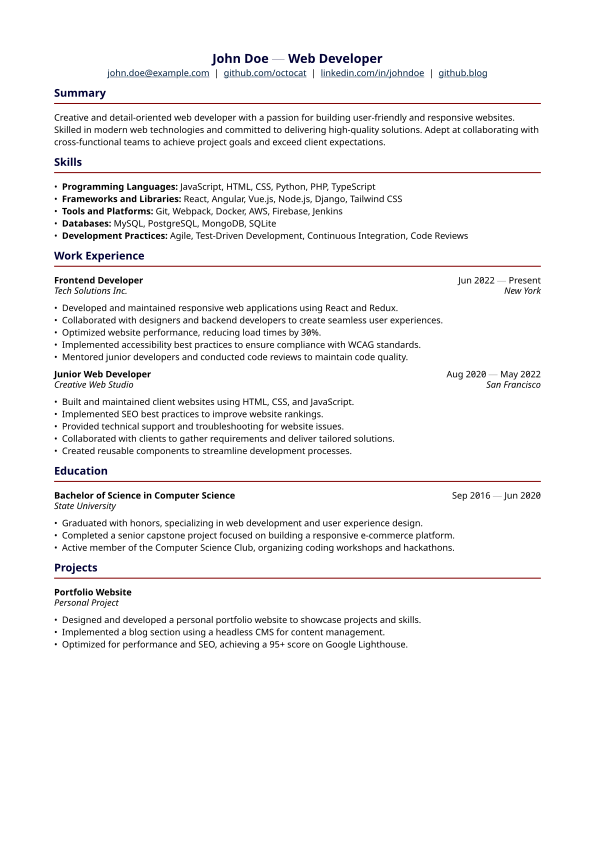

<div align="center">

# kiresume

A clean and customisable resume template. The name is a portmanteau of _kirei_ (きれい) meaning "clean" or "pretty", and _resume_.

---

<picture>
  
</picture>

</div>

## Usage

```typ
// main.typ
#import "@preview/kiresume:0.1.3": resume
#resume(..json("config.json"))
```

```bash
typst compile main.typ out.pdf
```
